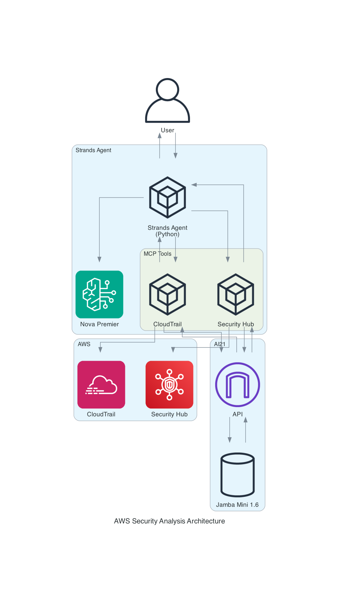

# AWS Security Analysis with AI21 Maestro & Strands Agents



This project demonstrates cutting-edge **agent-to-agent AI integration** using AI21 Maestro's requirement-driven report generation and Strands Agents for intelligent tool orchestration. The solution combines AWS Security Hub findings analysis and CloudTrail activity monitoring through **Model Context Protocol (MCP)** to provide comprehensive security insights powered by Amazon Bedrock Nova Premier and AI21's Jamba Mini 1.6 model.

## 🤖 Agent-to-Agent AI Integration: The Future is Here

• **Multi-Agent Architecture**: Built a Strands Agent that intelligently calls AI21 Maestro agentic tools through Model Context Protocol (MCP) - showcasing true agent-to-agent communication for AWS security analysis

• **MCP-Powered Tool Orchestration**: Leveraging Model Context Protocol to enable seamless interoperability between Amazon Bedrock Nova Premier (Strands) and AI21's Jamba Mini - proving that different AI systems can work together harmoniously

• **Intelligent Tool Selection**: The Strands Agent automatically determines when to invoke AI21 Maestro tools based on natural language queries - "Check my security findings" triggers Security Hub analysis, while "Analyze suspicious activity" calls CloudTrail monitoring

• **Validated AI Output**: AI21 Maestro's requirement-based validation ensures consistent, professional security reports every time - no hallucinations, no formatting inconsistencies, just reliable enterprise-grade analysis

• **Real-World Impact**: Transforming AWS security analysis from hours of manual work to seconds of AI-powered insights - analyzing thousands of Security Hub findings and CloudTrail events with structured, actionable recommendations

• **Open Source Innovation**: Built with MCP compatibility in mind, making these agentic tools reusable across different AI frameworks - contributing to the broader AI ecosystem interoperability

## 🚀 Features

### Core Capabilities
- **Security Hub Analysis**: Retrieves and analyzes AWS Security Hub findings with severity breakdown, affected resources, and issue categorization
- **CloudTrail Monitoring**: Analyzes CloudTrail events for suspicious activities, user behavior patterns, and geographic anomalies
- **AI21 Maestro Requirements**: Uses explicit constraints and validation cycles for consistent, professional security reports
- **Intelligent Agent**: Strands Agent powered by Amazon Bedrock Nova Premier for natural language interaction

### Technical Features
- **MCP Tool Integration**: Two focused tools compatible with Model Context Protocol for cross-framework reusability
- **Environment-based Configuration**: Secure API key management via environment variables
- **Simplified Architecture**: Streamlined async/sync handling with `asyncio.run()`
- **Enhanced Output Processing**: Clean response handling with proper text extraction
- **Robust Error Handling**: Comprehensive error management for AWS API calls and AI model interactions

## 📋 Requirements

- Python 3.10+
- AWS credentials configured with Security Hub and CloudTrail access
- AI21 API key (set as environment variable)
- Amazon Bedrock access (Nova Premier model)
- Appropriate IAM permissions for:
  - `securityhub:GetFindings`
  - `cloudtrail:LookupEvents`
  - `bedrock:InvokeModel`

## 🛠 Installation

1. Clone this repository
2. Install dependencies:
   ```bash
   pip install -r requirements.txt
   ```
3. Set your AI21 API key as an environment variable:
   ```bash
   export AI21_API_KEY=your_ai21_api_key_here
   ```
4. Ensure AWS credentials are configured:
   ```bash
   aws configure
   # or set environment variables
   export AWS_ACCESS_KEY_ID=your_key
   export AWS_SECRET_ACCESS_KEY=your_secret
   export AWS_DEFAULT_REGION=us-east-1
   ```

## 🎯 Usage

### Strands Agent with Agent-to-Agent Communication
```bash
python strands_ai21_maestro_agent.py
```

**Natural language interaction examples:**
- "Analyze my Security Hub findings" → Triggers Security Hub analysis via AI21 Maestro
- "Check CloudTrail for suspicious activity" → Invokes CloudTrail monitoring tool
- "What security issues should I prioritize?" → Agent determines best analysis approach
- "Are there any failed login attempts?" → Automatically selects CloudTrail analysis

## 🔧 MCP Tools: Agent-to-Agent Communication

### 1. `analyze_aws_security_hub()`
**Purpose**: Strands Agent → AI21 Maestro for Security Hub analysis

**Agent Communication Flow**:
1. Strands Agent (Nova Premier) receives user query
2. Agent determines Security Hub analysis is needed
3. Invokes MCP tool via `@tool` decorator
4. Tool calls AI21 Maestro with structured requirements
5. Maestro (Jamba Mini 1.6) validates output against requirements
6. Returns professional security report to Strands Agent
7. Agent presents insights to user

**AI21 Maestro Requirements**:
- Markdown formatting with proper headers and code blocks
- Include all numerical data in analysis
- Prioritize CRITICAL and HIGH severity findings
- Provide actionable remediation steps
- Professional security analyst tone
- Structured sections (Executive Summary, Severity Analysis, etc.)
- Concise length under 300 words
- No assumptions beyond provided data

### 2. `analyze_aws_cloudtrail()`
**Purpose**: Strands Agent → AI21 Maestro for CloudTrail insights

**Agent Communication Flow**:
1. User asks about suspicious activity or login patterns
2. Strands Agent intelligently selects CloudTrail analysis
3. MCP tool retrieves and processes CloudTrail events
4. Sends structured data to AI21 Maestro with requirements
5. Maestro generates validated security insights
6. Agent receives and presents actionable recommendations

**AI21 Maestro Requirements**:
- Markdown formatting with headers and numbered lists
- Highlight high-risk activities requiring investigation
- Analyze user behavior patterns for anomalies
- Geographic insights for unusual locations
- Focus on failed operations as security indicators
- Actionable security recommendations
- Threat assessment with risk rating
- Concise insights under 350 words

## 🎯 AI21 Maestro Requirements System

This project showcases AI21 Maestro's powerful requirements feature for agent-to-agent communication:

### How Agent-to-Agent Requirements Work
- **Explicit Constraints**: Strands Agent defines up to 10 specific requirements for AI21 Maestro
- **Generate → Validate → Fix Cycle**: Maestro creates, evaluates, and refines output until all requirements are met
- **Scoring System**: Each requirement is scored 0.0 to 1.0, with refinement for scores < 1.0
- **Budget Control**: Process continues until requirements are satisfied or budget is exhausted

### Agent Communication Flow
```
Strands Agent → MCP Tool → AI21 Maestro → Requirements Validation → Refined Output → Strands Agent → User
     ↑                                                                                    ↓
     ← ← ← ← ← ← ← ← ← ← ← ← ← ← ← ← ← ← ← ← ← ← ← ← ← ← ← ← ← ← ← ← ← ← ← ← ← ← ← ←
```

This ensures consistent, professional security reports through validated agent-to-agent communication.

## 📊 Example Agent-to-Agent Output

### Security Hub Analysis (Strands → AI21 Maestro)
```markdown
## AWS Security Hub Analysis Report

### Executive Summary
Your AWS environment shows 18 active security findings requiring attention...

### Severity Analysis
- **CRITICAL**: 2 findings requiring immediate action
- **HIGH**: 5 findings needing prompt remediation
- **MEDIUM**: 8 findings for scheduled resolution

### Recommended Actions
1. **Immediate**: Address EC2 instance vulnerabilities
2. **This Week**: Update S3 bucket policies
3. **This Month**: Review IAM permissions
```

## 🏗 Multi-Agent Architecture

### Agent Communication Components
1. **Strands Agent (Python)** - Main orchestrator using Nova Premier for reasoning
2. **MCP Protocol** - Enables seamless agent-to-agent communication
3. **Two Specialized AI21 Maestro Tools** - Security Hub and CloudTrail analysis
4. **Requirements Validation** - Ensures consistent, professional output
5. **AWS Services Integration** - Real-time security data sources

### Key Innovations in Agent-to-Agent Design
- **Environment Variable Configuration**: Secure API key management
- **Simplified Async Handling**: Clean `asyncio.run()` implementation for agent communication
- **Enhanced Response Processing**: Proper text extraction from multi-agent responses
- **MCP Compatibility**: Tools work across different AI frameworks
- **Intelligent Tool Selection**: Agent automatically chooses appropriate analysis based on user intent

## 🔒 Security Best Practices

### Environment Variables
```bash
# Required for agent-to-agent communication
export AI21_API_KEY=your_ai21_api_key

# AWS (if not using aws configure)
export AWS_ACCESS_KEY_ID=your_access_key
export AWS_SECRET_ACCESS_KEY=your_secret_key
export AWS_DEFAULT_REGION=us-east-1
```

### IAM Permissions (Minimum Required)
```json
{
    "Version": "2012-10-17",
    "Statement": [
        {
            "Effect": "Allow",
            "Action": [
                "securityhub:GetFindings",
                "cloudtrail:LookupEvents",
                "bedrock:InvokeModel"
            ],
            "Resource": "*"
        }
    ]
}
```

## 🐛 Troubleshooting

### Common Agent Communication Issues

1. **Missing AI21 API Key**
   ```
   ValueError: AI21_API_KEY environment variable is required
   ```
   **Solution**: Set the environment variable for agent-to-agent communication

2. **MCP Tool Response Processing**
   - Enhanced response handling extracts clean text from agent communications
   - Properly processes multi-agent response chains
   - Removes thinking tags for clean output

## 📁 Project Structure

```
aws-security-analysis/
├── strands_ai21_maestro_agent.py # Main agent-to-agent implementation
├── requirements.txt             # Python dependencies
└── README.md                   # This documentation
```

## 🔄 Dependencies

```
ai21==2.0.0                    # AI21 Maestro agent integration
boto3>=1.28.0                  # AWS SDK
botocore>=1.31.0               # AWS core functionality
python-dateutil>=2.8.2         # Date/time handling
strands-agents>=0.1.0          # Strands agent framework
strands-agents-tools>=0.1.0    # MCP tool support
```

## 🌟 Contributing to Agent-to-Agent AI

This project demonstrates the future of AI integration through:
- **MCP Protocol adoption** for cross-framework compatibility
- **Agent-to-agent communication** patterns
- **Requirements-driven validation** for reliable outputs
- **Open source innovation** in multi-AI orchestration

Contributions welcome to advance the agent-to-agent AI ecosystem!

## 📄 License

[MIT License](LICENSE)

## 🆘 Support

For issues and questions:
- AWS Security Hub: [AWS Documentation](https://docs.aws.amazon.com/securityhub/)
- AI21 Maestro: [AI21 Documentation](https://docs.ai21.com/docs/ai21-maestro-in-depth-guide)
- Strands Agents: [Strands Documentation](https://strandsagents.com)
- Amazon Bedrock: [Bedrock Documentation](https://docs.aws.amazon.com/bedrock/)
- Model Context Protocol: [MCP Documentation](https://modelcontextprotocol.io)